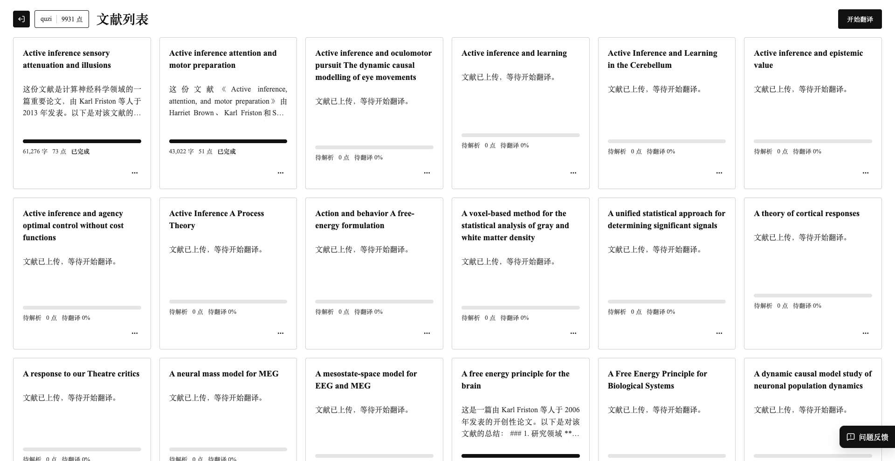
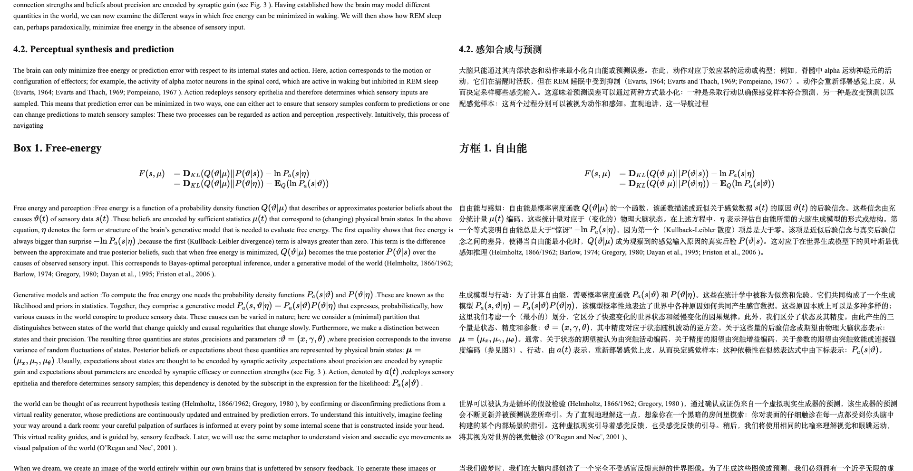
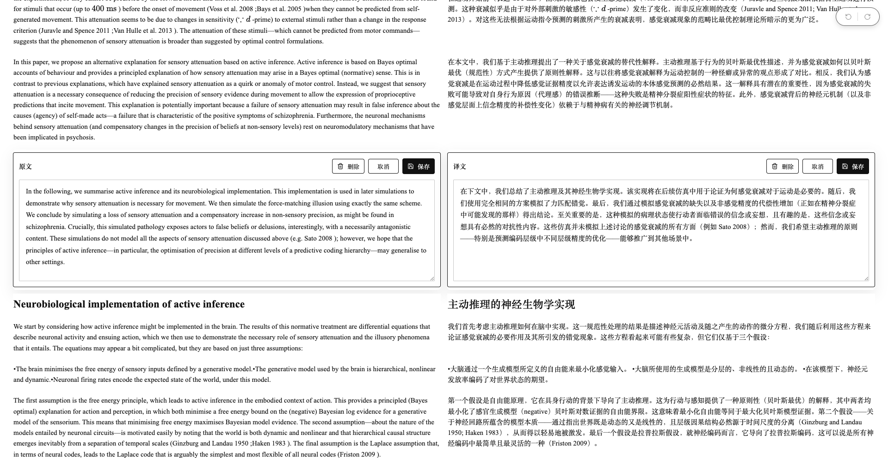
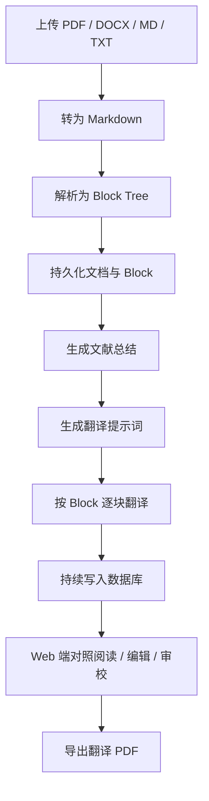
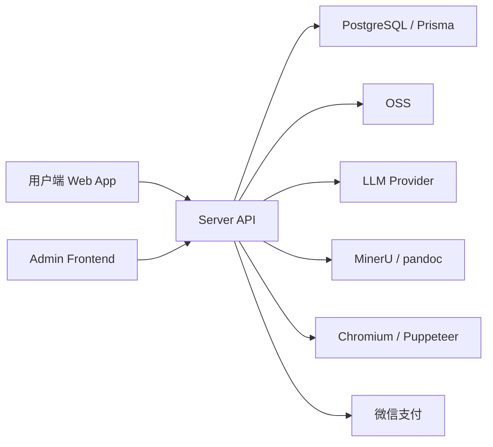

# 闻一翻译 / academic_translation

闻一翻译是一个面向学术文献的翻译工作台。

当前版本围绕一条完整工作流展开：上传 `PDF / DOCX / MD / TXT` 学术文档，将文档解析为 Markdown 和结构化 Block，完成文献总结、逐块翻译、对照阅读、人工校订与 PDF 导出，帮助研究者和译者先获得一版可阅读、可核对、可继续修改的中文结果。

## 快速入口

| 入口 | 链接 |
| --- | --- |
| 项目介绍 | [PROJECT_INTRO.md](./PROJECT_INTRO.md) |
| 演示视频 | [闻一翻译.mp4](./docs/assets/wenyi-intro.mp4) |
| 商务合作 | [合作咨询入口](https://xhslink.com/m/364W9UKcVdZ) |
| 微信联系 | [微信二维码](./docs/assets/wechat-qr.jpg) |

## 项目截图

### 文献列表



### 阅读页



### 编辑页



## 项目定位

- 面向学术文献的翻译工作台
- 以 `Markdown -> Block` 为核心的数据结构与工作流实验
- 面向“翻译后继续审校和编辑”的应用基础设施

## 核心功能

| 模块 | 当前能力 |
| --- | --- |
| 文档输入 | 支持上传 `PDF / DOCX / DOC / MD / TXT` |
| 文档解析 | `PDF -> Markdown` 通过 `MinerU / magic-pdf`，`DOCX / DOC -> Markdown` 通过 `pandoc` |
| Block 化 | 支持标题、正文、公式、代码、图片、表格、引用、列表等块类型 |
| 文献理解 | 自动生成文献总结，基于摘要生成翻译提示词 |
| 翻译执行 | 按 Block 逐块翻译，翻译中间结果持续写入数据库 |
| 数学保护 | 对公式片段进行保护、恢复和导出阶段再渲染 |
| 阅读体验 | 原文 / 译文左右对照，支持只看译文 |
| 人工校订 | 支持按 Block 编辑原文与译文，支持删除、恢复、撤销、重做 |
| 任务管理 | 支持开始、停止、重试、删除、断点恢复、进度展示 |
| 点数系统 | 注册登录、钱包、订单、点数流水、消费记录 |
| 支付 | 支持微信原生支付、订单超时、取消、继续支付 |
| 导出 | 支持导出翻译结果 PDF，重新渲染标题、正文、图片、表格与公式 |
| 反馈与后台 | 用户反馈、后台查看文档、订单、用户、反馈、套餐与配置 |

## 路线图

以下方向是项目计划继续深入但尚未完整完成的能力。

| 方向 | 计划内容 |
| --- | --- |
| 长文献 / 专著翻译工作台 | 自动章节切分、章节级摘要、章节级提示词、章节级重试、长文献目录树、分阶段导出 |
| 可信翻译 | 模型补充风险标记、术语不一致提示、公式 / 图表 / 图注异常提示、来源回指 |
| 术语一致性系统 | 自动提取术语、一词多译冲突识别、推荐译法锁定、全书一致性回扫 |
| 学科化翻译策略 | 面向哲学、社科、医学、神经科学、数学、物理等学科场景优化翻译与公式处理 |
| 机构协作与私有部署 | 私有术语库、审校工作流、团队协作、版本记录、机构翻译资产沉淀 |

## 商业合作与共建

欢迎将项目带入真实学术场景中继续打磨，尤其适合以下合作对象：

| 合作对象 | 可合作方向 |
| --- | --- |
| 高校 / 实验室 / 研究中心 | 长文献与专著翻译、学科术语体系、院内私有部署 |
| 出版机构 / 翻译团队 | 审校工作流、版本管理、术语沉淀、团队协作 |
| 研究机构 / 专业团队 | 可信翻译、术语一致性、专用翻译中台建设 |

进一步交流方式：

- 小红书： [合作咨询入口](https://xhslink.com/m/364W9UKcVdZ)
- 如需进一步沟通，可扫码添加微信：


项目视频介绍：

[闻一翻译.mp4](./docs/assets/wenyi-intro.mp4)

## 仓库结构

| 目录 | 说明 |
| --- | --- |
| `website/` | 官网静态落地页 |
| `web-app/` | C 端 Web 应用，默认开发端口 `7001` |
| `admin-frontend/` | 后台管理系统 |
| `server/` | API、支付、点数、文档解析、翻译任务，默认端口 `7000` |

## 技术架构

| 层级 | 技术栈 |
| --- | --- |
| Web App | React + Vite + KaTeX + react-markdown |
| Admin Frontend | React + Vite |
| Server | Node.js + Express |
| 数据库 | PostgreSQL + Prisma |
| 文件存储 | 阿里云 OSS |
| 文档解析 | MinerU / magic-pdf、pandoc |
| PDF 导出 | Puppeteer + Chromium / Chrome |
| 支付 | 微信支付 |

## 核心流程图

### 1. 翻译主流程



### 2. 系统组成



## 典型工作流

| 步骤 | 说明 |
| --- | --- |
| 1 | 用户注册或登录 |
| 2 | 用户充值点数 |
| 3 | 上传学术文档 |
| 4 | 服务端将原文转为 Markdown |
| 5 | Markdown 被解析成 Block 树并持久化 |
| 6 | 系统生成文献总结 |
| 7 | 系统生成翻译提示词 |
| 8 | 系统逐块翻译并持续写入数据库 |
| 9 | 用户在 Web 端对照阅读、编辑、审校 |
| 10 | 用户导出翻译 PDF |

## 本地开发

### 最小可运行配置

| 步骤 | 操作 |
| --- | --- |
| 1 | 准备 PostgreSQL，并创建数据库 `academic_translation` |
| 2 | 复制 `server/.env.example` 为 `server/.env` |
| 3 | 至少配置 `DATABASE_URL`、`JWT_SECRET`、`OSS_*`、`LLM_*`、`MINERU_BIN`、`CHROME_BIN` |
| 4 | 执行数据库初始化 |
| 5 | 创建后台管理员账号 |
| 6 | 分别启动 `server`、`web-app`、`admin-frontend` |

### 依赖要求

| 依赖 | 说明 |
| --- | --- |
| Node.js 18+ | 前后端运行环境 |
| PostgreSQL 14+ | 主数据库 |
| `pandoc` | `DOCX / DOC -> Markdown` |
| `MinerU / magic-pdf` | `PDF -> Markdown` |
| Chromium / Google Chrome | PDF 导出 |

### 可选说明

| 条件 | 影响 |
| --- | --- |
| 未配置微信支付 | 项目可本地启动，但无法测试真实充值流程 |
| 未配置 OSS | 上传文档与图片链路不可用 |
| 未配置 `MINERU_BIN` | 无法解析 PDF，但仍可测试 `DOCX / MD / TXT` |

### Server

```bash
cd server
npm install
cp .env.example .env
npx prisma generate
npx prisma db push
npm run agreements:init
npm run admin:init -- --username admin --email admin@example.com --password change-this-password --role superadmin
npm run dev
```

默认端口：`7000`

可选操作：

| 场景 | 命令 |
| --- | --- |
| 端口冲突 | `PORT=17000 npm run dev` |
| 本地创建数据库 | `CREATE DATABASE academic_translation;` |
| 重新生成 Prisma Client | `npx prisma generate` |

### Web App

```bash
cd web-app
npm install
npm run dev
```

默认端口：`7001`

### Admin Frontend

```bash
cd admin-frontend
npm install
npm run dev
```

### 管理员初始化

命令行方式：

```bash
cd server
npm run admin:init -- --username admin --email admin@example.com --password your-password --role superadmin
```

环境变量方式：

```bash
ADMIN_USERNAME=admin \
ADMIN_EMAIL=admin@example.com \
ADMIN_PASSWORD=your-password \
ADMIN_ROLE=superadmin \
npm run admin:init
```

脚本行为：

| 场景 | 行为 |
| --- | --- |
| 用户不存在 | 自动创建管理员 |
| 用户已存在 | 更新邮箱、密码和角色 |

### 协议初始化

```bash
cd server
npm run agreements:init
```

### Website

```bash
python3 -m http.server 8088 -d website
```

访问地址：`http://localhost:8088`

## 环境变量

### 基础服务

| 变量 | 必填 | 说明 |
| --- | --- | --- |
| `NODE_ENV` | 否 | 运行环境，默认 `development` |
| `PORT` | 否 | Server 端口，默认 `7000` |
| `DATABASE_URL` | 是 | PostgreSQL 连接串 |
| `JWT_SECRET` | 是 | JWT 签名密钥 |
| `JWT_EXPIRES_IN` | 否 | Token 有效期，默认 `7d` |

### 对象存储

| 变量 | 必填 | 说明 |
| --- | --- | --- |
| `OSS_ENDPOINT` | 是 | OSS Endpoint |
| `OSS_KEY_ID` | 是 | OSS AccessKey ID |
| `OSS_KEY_SECRET` | 是 | OSS AccessKey Secret |
| `OSS_BUCKET` | 是 | OSS Bucket 名称 |
| `OSS_FOLDER` | 否 | OSS 根目录前缀 |

### 翻译与生成

| 变量 | 必填 | 说明 |
| --- | --- | --- |
| `LLM_BASE_URL` | 是 | 大模型服务地址 |
| `LLM_API_KEY` | 是 | 大模型 API Key |
| `LLM_MODEL` | 是 | 翻译与摘要使用的模型 |

### 解析与导出

| 变量 | 必填 | 说明 |
| --- | --- | --- |
| `MINERU_BIN` | 是 | `magic-pdf` 可执行文件路径 |
| `CHROME_BIN` | 是 | Chromium / Chrome 可执行文件路径 |

### 微信支付

| 变量 | 必填 | 说明 |
| --- | --- | --- |
| `WX_APPID` | 否 | 微信 AppID |
| `WX_MCHID` | 否 | 商户号 |
| `WX_PUBLIC_KEY_ID` | 否 | 微信平台公钥 ID |
| `WX_SERIAL_NO` | 否 | 商户证书序列号 |
| `WX_PRIVATE_KEY_PATH` | 否 | 商户私钥路径 |
| `WX_PUBLIC_KEY_PATH` | 否 | 微信平台公钥路径 |
| `WX_NOTIFY_URL` | 否 | 支付回调地址 |
| `WX_API_V3_KEY` | 否 | 微信支付 API v3 Key |

### 扩展能力

| 变量 | 必填 | 说明 |
| --- | --- | --- |
| `GEMINI_API_KEY` | 否 | 部分 AI 扩展能力依赖 |
| `GEMINI_BASE` | 否 | Gemini API Base |
| `GPTIMAGE_BASE_URL` | 否 | 图像服务地址 |
| `GPTIMAGE_API_KEY` | 否 | 图像服务 Key |
| `IMAGE_PROVIDER` | 否 | 图像服务提供方 |
| `MINIMAX_API_KEY` | 否 | TTS / 音色同步能力依赖 |
| `WX_MINI_APPID` | 否 | 微信小程序 AppID |
| `WX_MINI_SECRET` | 否 | 微信小程序 Secret |

## 数据模型

### 核心数据表

| 表 | 说明 |
| --- | --- |
| `customers` | C 端用户 |
| `customer_wallets` | 用户钱包 |
| `point_ledgers` | 点数流水 |
| `plans` | 充值套餐 |
| `orders` / `payments` | 订单与支付 |
| `translation_documents` | 翻译文档主记录 |
| `translation_blocks` | 块级原文与译文 |
| `support_tickets` / `support_ticket_messages` | 反馈与回复 |
| `users` | 后台管理员 |

### 翻译主数据

| 模型 | 关键字段 |
| --- | --- |
| `translation_documents` | 原文件信息、Markdown、摘要、翻译提示词、状态、进度、点数消耗 |
| `translation_blocks` | `rootId`、`parentId`、`type`、`sequence`、`sourceText`、`translatedText`、`status` |

## 任务与计费

| 项目 | 说明 |
| --- | --- |
| 点数估算 | 文档解析后按字符规模估算翻译消耗 |
| 活动任务限制 | 同一用户同一时间仅允许一个活动翻译任务 |
| 中断恢复 | 支持停止、重试、删除与断点继续 |
| 重试策略 | 从缺失位置继续，而不是默认整篇重跑 |
| 订单控制 | 支持未支付订单超时、取消、继续支付 |

## 部署

### Docker Compose

```bash
docker-compose --env-file server/.env.production up -d --build
```

### 默认端口

| 服务 | 端口 |
| --- | --- |
| API | `7000` |
| Web App | `7001` |
| Admin | `7002` |

### 常见部署方式

| 组件 | 方式 |
| --- | --- |
| `server` | 本地 Node 进程或容器部署 |
| `web-app` | Docker / Nginx 托管 |
| `admin-frontend` | Docker / Nginx 托管 |
| `website` | 静态资源部署 |

## 当前限制

| 方面 | 说明 |
| --- | --- |
| 长文献支持 | 超长专著的章节化工作流仍在完善 |
| 术语系统 | 术语一致性能力尚未形成完整体系 |
| 风险提示 | 可信翻译风险层仍需继续加强 |
| 后台清理 | 仍有部分从旧项目复用而来的模块需要进一步整理 |
| 首次接入门槛 | 需要正确安装 `MinerU`、`pandoc`、`Chromium` 与外部服务配置 |

## 适用对象

| 人群 | 适合原因 |
| --- | --- |
| 想研究 `Markdown -> Block` 工作流的开发者 | 可直接看到文档结构化与翻译任务设计 |
| 想做学术翻译产品原型的团队 | 已具备完整基础链路 |
| 想继续深化长文献 / 可信翻译 / 术语系统的人 | 当前结构便于向这些方向演进 |
| 想做高校 / 研究机构 / 出版团队私有方案的人 | 已具备可扩展的工作流底座 |

## License

本项目当前使用 `MIT License`。
